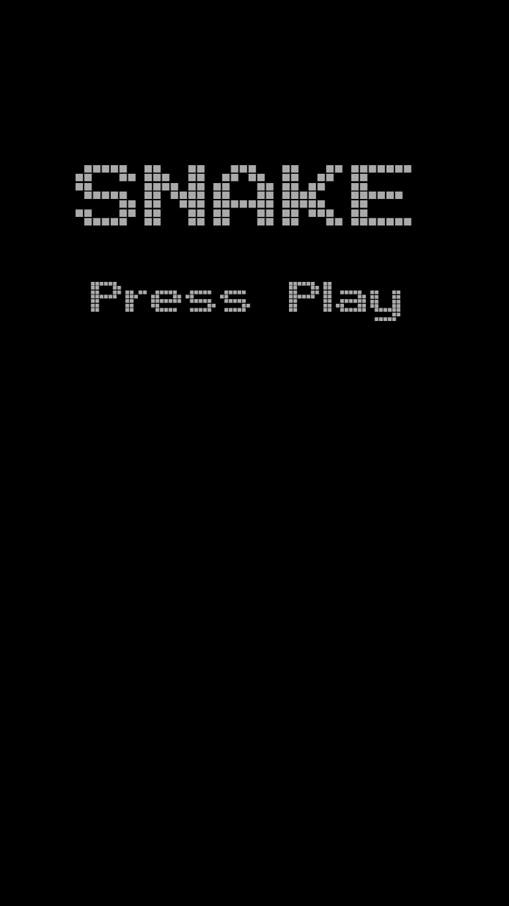
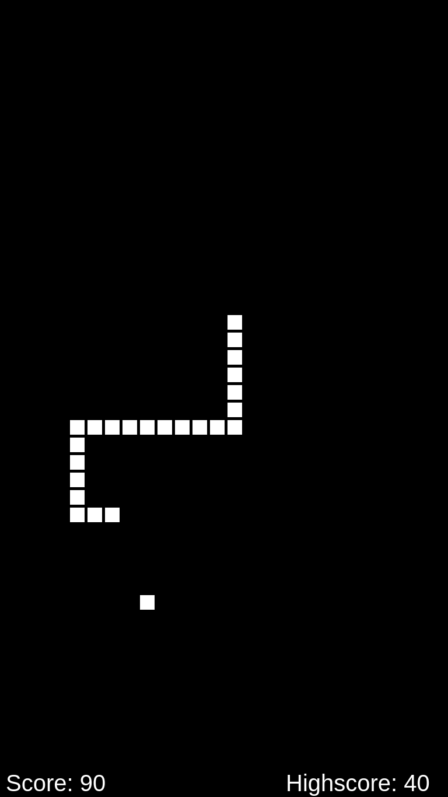

# MMM-Snake
This is a module for the [MagicMirror](https://github.com/MichMich/MagicMirror).

<p float="left">
	
	
</p>

Play the retro game Snake:snake: on your mirror using your smartphone (or any other device with a web browser).

## Installation
Clone repository:
```
cd MagicMirror/modules/
git clone https://github.com/superuserx/MMM-Snake.git
```

Add module to config.js:
```
{
	module: "MMM-Snake",
	position: "fullscreen_below",
	config: {
		startsize: 5,
		speed: 5
	}
}
```
### Important
You have to set the *address* to an accessible interface (or 0.0.0.0) and add the IP address of the device you want to use as a controller to *ipWhitelist* or allow all IP addresses in config.js.

Your controller device must be on the same network.

## Options
| Option | Description |
|--------|-------------|
| startsize | Snake size at start |
| speed | Game speed |
